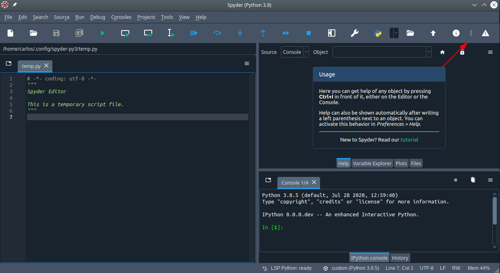

# Custom toolbar

Example that shows how to add a custom toolbar to Spyder

## Features

* Custom toolbar with a couple of actions that show an informative message and a warning using QMessageBox'es.

## Preview

* Custom toolbar

* Toolbar in action

## Credits

This package was created with [Cookiecutter](https://github.com/audreyr/cookiecutter) and the [spyder-ide/spyder5-plugin-cookiecutter](https://github.com/spyder-ide/spyder5-plugin-cookiecutter) project template.
