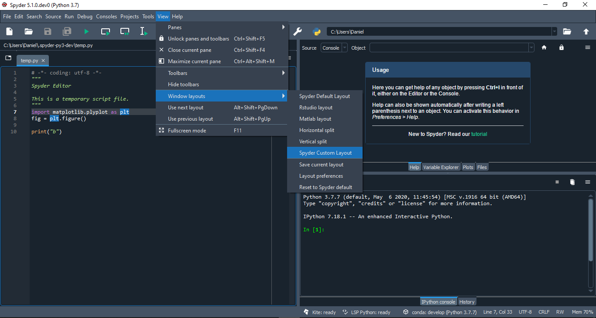
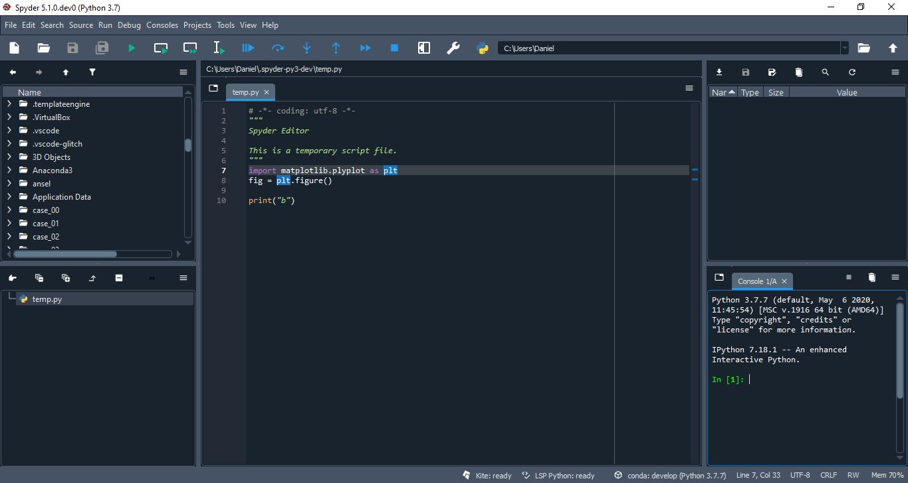
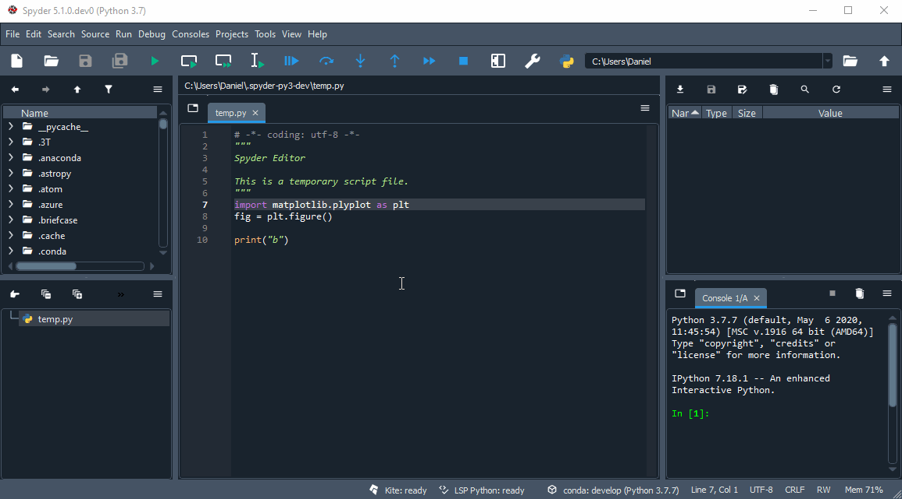
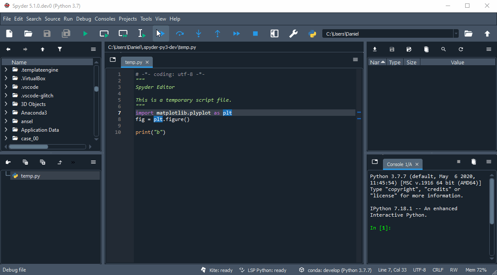

# Spyder Custom Layout

Example plugin that register a programmatic custom layout

## Features

* Example custom layout [class definition (`CustomLayout`)](./spyder_custom_layout/spyder/api.py#:~:text={CustomLayout})

* Example [registration through the attribute class `CUSTOM_LAYOUTS`](./spyder_custom_layout/spyder/plugin.py#:~:text={CUSTOM_LAYOUTS}) of a custom layout definition

* Example [`class attribute TABIFY` usage](./spyder_custom_layout/spyder/plugin.py#:~:text={TABIFY}) for plugin pane setup

## Preview

* Custom layout entry in the layouts menu:

* Custom layout applied:

* Plugin docking space after layout application if `TABIFY` attribute is defined :

* Plugin docking space after layout application without `TABIFY` attribute definition:

## Credits

This package was created with [Cookiecutter](https://github.com/audreyr/cookiecutter) and the [spyder-ide/spyder5-plugin-cookiecutter](https://github.com/spyder-ide/spyder5-plugin-cookiecutter) project template.
