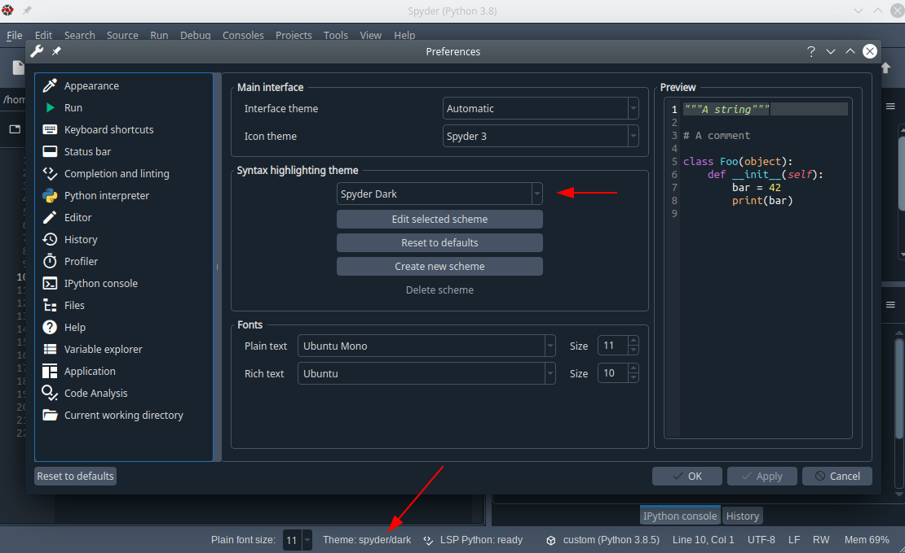
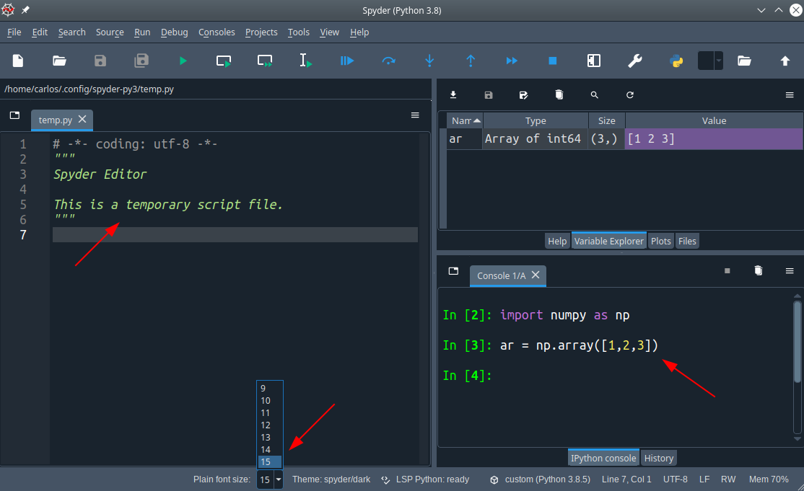

# Status bar widgets

Example that shows how to add wigets to the status bar

## Features

* Widget that shows the current syntax highlighting theme in the status bar (`ThemeStatusWidget`)

* Custom status bar widget that allows to change the plain text font size using a dropdown (`PlainFontSizeStatus`)

## Preview

* Syntax highlighting theme widget

* Font size combobox widget

## Credits

This package was created with [Cookiecutter](https://github.com/audreyr/cookiecutter) and the [spyder-ide/spyder5-plugin-cookiecutter](https://github.com/spyder-ide/spyder5-plugin-cookiecutter) project template.
